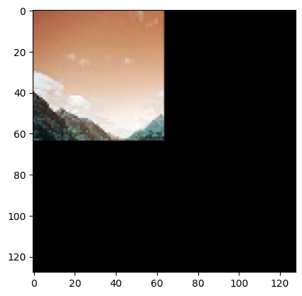
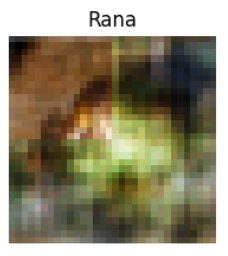
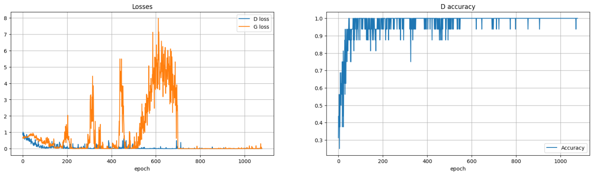

# GAN Image Expansion (Image Outpainting)

Team project exploring image outpainting with generative adversarial networks: the model receives only a small corner of an image and learns to generate the missing rest.

**Authors:** Raúl Baeza Osuna, Lucas Trujillo Cubillo and Iván Molina Abellán.

## What it does

- Uses the public [Landscape Pictures](https://www.kaggle.com/datasets/arnaud58/landscape-pictures) dataset from Kaggle, resized to 128x128 pixels.
- During training, only a 64x64 corner of each image is shown to the generator, which must complete the rest of the picture coherently.

## Repository contents

- `GAN_de_Expansión_de_Imágenes_Primer_Modelo_GAN.ipynb` - first GAN model trained on the landscape dataset, plus a conditional-GAN experiment on CIFAR-10. At low resolution the network produced coherent completions, capturing both shape and color of the missing region.

  

- `Segundo_Modelo_GAN.ipynb` - a second, more ambitious model working on full 128x128x3 inputs. Training did not meet expectations: the GAN failed to generate coherent images and showed training instability (including gradient explosion), limited by the available environment and time. The notebook documents the attempt and its conclusions.

  

## Tech stack

Python, TensorFlow/Keras, OpenCV, scikit-learn, Matplotlib. Built to run on Google Colab with the Kaggle API for dataset download.

## Status

University coursework project, kept as an experiment log. No license specified yet.
